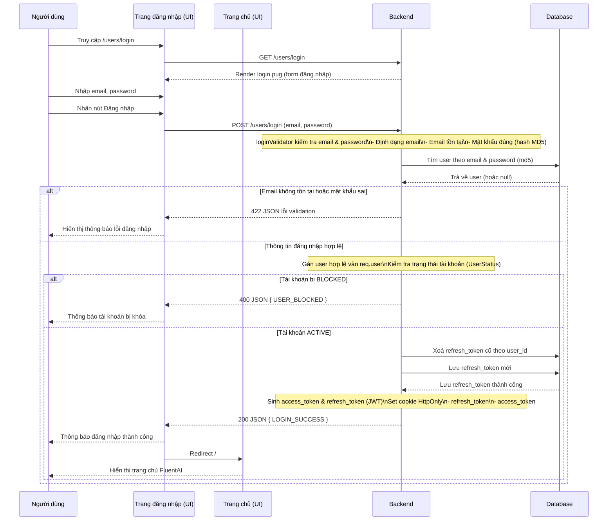

## Quy ước vẽ sequence diagram (Mermaid) cho FluentAI

### 1. Cấu hình chung cho Mermaid

- **Theme & nền sáng**: Mọi file `.mermaid` đều thêm dòng sau ở đầu file:

```mermaid
%%{init: {'theme': 'neutral', 'themeVariables': { 'background': '#ffffff' }}}%%
```

### 2. Đặt tên actor (participant)

- **Người dùng**:
  - `participant User as Người dùng`
- **Các trang giao diện phía client (UI)**:
  - Trang đăng nhập: `participant LoginPage as Trang đăng nhập (UI)`
  - Trang chủ: `participant HomePage as Trang chủ (UI)`
  - Các trang khác: đặt theo mẫu `XxxPage as <Tên trang> (UI)`
- **Backend** (đã gộp Route + Middleware + Controller + Service):
  - `participant Backend as Backend`
  - Không tách riêng `Route`, `Controller`, `Service` trong sơ đồ; mô tả chi tiết bằng `Note over Backend`.
- **Database**:
  - `participant DB as Database`
  - Khi cần cụ thể: có thể ghi trong alias, ví dụ `Database (MongoDB)` nhưng giữ tên participant là `DB`.
- **Các hệ thống ngoài (external systems)**:
  - Chỉ khai báo khi **thực sự được dùng trong luồng đó**.
  - Ví dụ khi cần:
    - Nodemailer: `participant Mail as Nodemailer`
    - S3: `participant S3 as S3 Storage`
    - Gemini: `participant Gemini as Gemini API`
    - TextToSpeech: `participant TTS as TextToSpeech API`

### 3. Cách mô tả luồng đăng nhập người dùng

- **Actor sử dụng**: `User`, `LoginPage`, `HomePage`, `Backend`, `DB`.
- **Luồng chính** (mẫu trích lược):



### 4. Quy ước chung khi vẽ các sơ đồ khác

- **Chỉ khai báo hệ thống ngoài khi có call thực tế trong code**:
  - Ví dụ luồng OTP qua email: thêm `Mail` và mô tả `Backend->>Mail: sendMail(...)`.
  - Luồng upload avatar: thêm `S3` với `Backend->>S3: uploadImage(...)`.
  - Luồng sinh nội dung AI: thêm `Gemini` với `Backend->>Gemini: Gửi prompt/nhận kết quả`.
  - Luồng chuyển văn bản thành giọng nói: thêm `TTS` với `Backend->>TTS: Gửi text/nhận audio`.
- **Dùng `Note over` để gom logic nội bộ Backend** thay vì tách nhiều actor nhỏ.
- **Dùng `alt / else / end`** cho các nhánh:
  - Dữ liệu không hợp lệ / hợp lệ.
  - Tài khoản bị khóa / hoạt động.
  - Call external service thành công / thất bại (nếu cần thể hiện).

### 5. Mục tiêu

- Giữ sơ đồ **đơn giản, nhất quán**, dễ dùng cho tài liệu BA & báo cáo.
- Mọi sơ đồ mới nên **tuân theo quy ước actor & cấu trúc** ở trên để các đoạn chat sau có thể tự động vẽ đúng theo source code.
