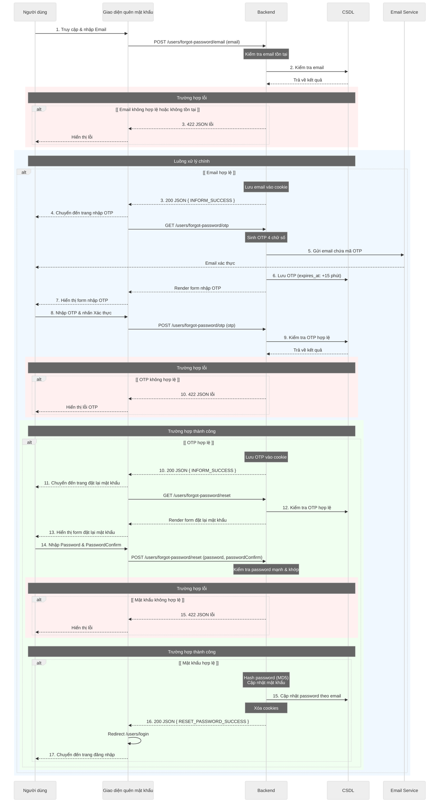

# Hướng dẫn vẽ Sơ đồ Tuần tự (Sequence Diagram) bằng Mermaid

## 1. Cấu trúc cơ bản

### 1.1. Khởi tạo theme

Mỗi sơ đồ bắt đầu với cấu hình theme:

```mermaid
%%{init: {'theme': 'neutral', 'themeVariables': { 'background': '#ffffff' }}}%%
sequenceDiagram
```

### 1.2. Định nghĩa Participants (Thành phần tham gia)

Định nghĩa các thành phần tham gia vào luồng xử lý:

```mermaid
participant User as Người dùng
participant LoginUI as Giao diện đăng nhập
participant Backend as Backend
participant DB as CSDL
participant Mail as Email Service
```

**Quy ước đặt tên:**

- Tên participant ngắn gọn, dễ hiểu (ví dụ: `User`, `LoginUI`, `Backend`, `DB`)
- Tên hiển thị bằng tiếng Việt, mô tả rõ ràng (ví dụ: `Người dùng`, `Giao diện đăng nhập`, `CSDL`)
- Backend luôn được đặt tên là `Backend` (không dùng "Hệ thống xử lý")

## 2. Các loại Message (Tin nhắn)

### 2.1. Message đồng bộ (Synchronous)

Sử dụng `->>` cho request và `-->>` cho response:

```mermaid
User->>LoginUI: 1. Truy cập /users/login
LoginUI->>Backend: GET /users/login
Backend-->>LoginUI: Render form đăng nhập
LoginUI-->>User: 2. Hiển thị form đăng nhập
```

### 2.2. Message nội bộ (Self message)

Khi một participant tự xử lý hoặc redirect:

```mermaid
LoginUI->>LoginUI: Redirect /
```

## 3. Notes (Ghi chú)

### 3.1. Note trên một participant

Mô tả logic xử lý bên trong một thành phần:

```mermaid
Note over Backend: loginValidator kiểm tra:<br/>- Định dạng email<br/>- Email tồn tại<br/>- Mật khẩu đúng (MD5)
```

**Lưu ý:** Sử dụng `<br/>` để xuống dòng trong note.

### 3.2. Note trên nhiều participants

Mô tả cho một nhóm các thành phần:

```mermaid
Note over User,DB: Trường hợp lỗi
Note over User,DB: Luồng xử lý chính
Note over User,DB: Trường hợp thành công
```

## 4. Alt Fragments (Điều kiện rẽ nhánh)

Sử dụng `alt` để mô tả các trường hợp xử lý khác nhau:

```mermaid
alt [ Điều kiện ]
    Backend-->>LoginUI: Response 1
else [ Điều kiện khác ]
    Backend-->>LoginUI: Response 2
end
```

**Quy ước:**

- Điều kiện đặt trong dấu ngoặc vuông `[ ]`
- Luôn có `else` và `end` để đóng khối điều kiện

## 5. Rect với màu sắc (Khối màu)

Sử dụng `rect` để nhóm các luồng xử lý và tô màu cho trực quan:

### 5.1. Màu đỏ nhạt - Trường hợp lỗi

```mermaid
rect rgb(255, 240, 240)
    Note over User,DB: Trường hợp lỗi
    alt [ Thông tin không hợp lệ ]
        Backend-->>LoginUI: 422 JSON lỗi validation
        LoginUI-->>User: Hiển thị thông báo lỗi
    end
end
```

### 5.2. Màu xanh nhạt - Luồng xử lý chính

```mermaid
rect rgb(240, 248, 255)
    Note over User,DB: Luồng xử lý chính
    alt [ Thông tin hợp lệ ]
        %% Các bước xử lý chính
    end
end
```

### 5.3. Màu xanh lá nhạt - Trường hợp thành công

```mermaid
rect rgb(240, 255, 240)
    Note over User,DB: Trường hợp thành công
    alt [ Điều kiện thành công ]
        Backend-->>LoginUI: 200 JSON { SUCCESS }
    end
end
```

**Bảng màu chuẩn:**

- `rgb(255, 240, 240)` - Màu đỏ nhạt: Trường hợp lỗi
- `rgb(240, 248, 255)` - Màu xanh nhạt: Luồng xử lý chính
- `rgb(240, 255, 240)` - Màu xanh lá nhạt: Trường hợp thành công

## 6. Đánh số thứ tự các bước

Mỗi message quan trọng được đánh số thứ tự để dễ theo dõi:

```mermaid
User->>LoginUI: 1. Truy cập /users/login
LoginUI-->>User: 2. Hiển thị form đăng nhập
User->>LoginUI: 3. Nhập Email và Password
User->>LoginUI: 4. Nhấn nút Đăng nhập
LoginUI->>Backend: POST /users/login (email, password)
Backend->>DB: 5. Tìm user theo email & password (MD5)
```

**Quy ước:**

- Đánh số liên tục từ 1, 2, 3...
- Chỉ đánh số cho các bước quan trọng, không đánh số cho response trả về trực tiếp
- Số thứ tự đặt ở đầu message, sau dấu `:`

## 7. Comments (Ghi chú code)

Sử dụng `%%` để thêm ghi chú trong code, giúp tổ chức các phần:

```mermaid
%% 1. Truy cập trang đăng nhập
User->>LoginUI: 1. Truy cập /users/login

%% 2. Nhập và gửi thông tin
User->>LoginUI: 3. Nhập Email và Password

%% 3. Validation và kiểm tra
Note over Backend: loginValidator kiểm tra

%% 4. Xử lý kết quả
alt [ Thông tin không hợp lệ ]
```

## 8. Cấu trúc sơ đồ

Sơ đồ tuần tự tập trung vào luồng chính, gộp các bước liên quan và loại bỏ các chi tiết không cần thiết để dễ đọc và theo dõi.

### 8.1. Nguyên tắc vẽ sơ đồ

1. **Gộp các bước user action**: Gộp các bước liên quan của người dùng thành một bước:

   ```mermaid
   User->>ForgotPasswordUI: 1. Truy cập & nhập Email
   ```

   Thay vì tách riêng "Truy cập" và "Nhập Email"

2. **Loại bỏ các bước render chi tiết**: Chỉ giữ lại các bước render quan trọng, không mô tả chi tiết từng bước GET request

3. **Đơn giản hóa các Note**: Chỉ giữ thông tin cốt lõi, bỏ các mô tả dài dòng:

   ```mermaid
   Note over Backend: Kiểm tra email tồn tại
   ```

   Thay vì mô tả chi tiết từng bước validation

4. **Giảm số lượng rect lồng nhau**: Chỉ sử dụng rect khi thực sự cần thiết để nhóm logic, tránh lồng quá nhiều lớp

5. **Tập trung vào luồng chính**: Loại bỏ các bước kiểm tra trung gian không quan trọng, chỉ giữ lại các bước quyết định chính (Validation → Xử lý → Kết quả)

6. **Gộp các bước liên quan**: Khi có nhiều bước liên quan đến cùng một chức năng, gộp lại:

   ```mermaid
   User->>ForgotPasswordUI: 8. Nhập OTP & nhấn Xác thực
   ```

7. **Đơn giản hóa response**: Chỉ giữ response quan trọng, bỏ các response trung gian:
   ```mermaid
   Backend-->>ForgotPasswordUI: 3. 422 JSON lỗi
   ```

### 8.2. Ví dụ sơ đồ



## 9. Best Practices (Thực hành tốt)

1. **Đặt tên rõ ràng:** Tên participant và message phải mô tả chính xác chức năng
2. **Sử dụng màu sắc nhất quán:** Tuân thủ bảng màu chuẩn để dễ nhận biết
3. **Đánh số thứ tự:** Giúp người đọc theo dõi luồng xử lý dễ dàng
4. **Nhóm logic:** Sử dụng `rect` và `alt` để nhóm các luồng xử lý liên quan
5. **Ghi chú đầy đủ:** Thêm `Note` để giải thích logic phức tạp
6. **Tổ chức code:** Sử dụng comments `%%` để phân chia các phần
7. **Nhất quán:** Giữ cấu trúc và phong cách giống nhau trong toàn bộ dự án
8. **Áp dụng nguyên tắc rút gọn:** Luôn gộp các bước liên quan, đơn giản hóa note, và tập trung vào luồng chính

## 10. Lưu ý kỹ thuật

- Sử dụng `<br/>` để xuống dòng trong `Note`
- Đảm bảo mỗi `alt` có `else` và `end` tương ứng
- Mỗi `rect` phải có `end` để đóng khối
- Backend luôn được đặt tên là `Backend`, không dùng tên khác
- Màu sắc sử dụng định dạng `rgb(r, g, b)` với giá trị từ 0-255
